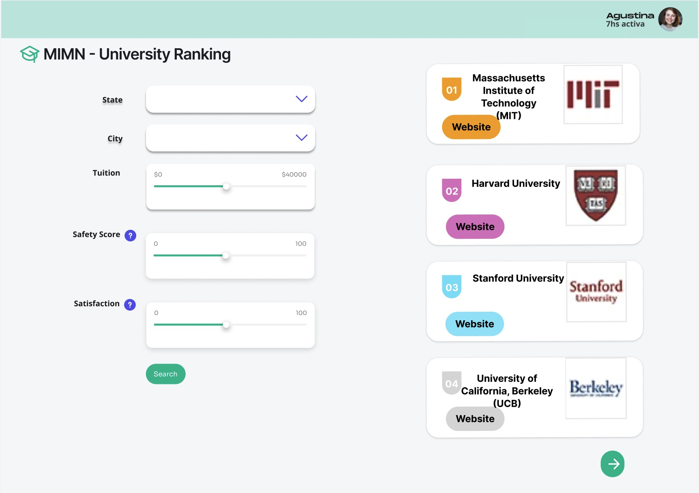

# Dream College Navigator

## 1. Summary

Dream College Navigator is an innovative program that uses comprehensive data analytics to streamline college admission processes for prospective students. Our technology relies on a comprehensive database of schools to provide personalized college suggestions based on the user's academic background and preferences.

The procedure begins with users providing their requirements, including academic programs, finances, campus life experience, safety norms, and more. ⁤⁤This initial, intensive screening yields a list of universities that meet the user's given interests. ⁤⁤To further refine this list, the platform asks users to contribute more personal information, such as test scores, and extracurricular activities. ⁤⁤Using these facts, the user not only meets the academic requirements for these colleges but also has a good chance of being accepted, combining ideal and practical admission opportunities. ⁤⁤This two-tiered method combines an enormous database of schools with tailored data analysis to guarantee that customers are presented with options that are both desirable and attainable.

## 2. Description

⁤The primary issues we address are information overload and analysis paralysis, which frequently accompany the college-choosing process. ⁤⁤Many students and families become confused in a sea of data, unsure how to balance aspects such as program quality, cost, campus culture, and safety with their personal preferences and academic profiles. ⁤⁤Furthermore, the opaque nature of college admissions standards adds to the complexity, making it impossible for applicants to precisely predict their prospects of admittance.

⁤Our application streamlines this process by providing a comprehensive yet user-friendly platform where users can enter their requirements and preferences across a variety of essential parameters. ⁤From academic disciplines and financial considerations to campus environment and safety regulations, Dream College Navigator uses a sophisticated algorithm to match user inputs with appropriate institutions from our huge database.

## 3. Usefulness

Dream College Navigator is designed to be a comprehensive tool that simplifies the college search and application process, making it more efficient and tailored to individual needs. Its usefulness stems from its ability to distill vast amounts of data into personalized recommendations, thereby saving users time and providing clarity in a process that can often feel overwhelming.

### 3.1 Basic Functions:
Personalized College Search: Users can input their preferences for major, location, size, campus culture, and more, to receive a list of colleges that match their criteria.
Admission Probability Calculator: Users can enter their academic information, such as test scores, to get an estimate of their chances of admission at various schools.

### 3.2 Complex Features:
Scenario Simulation Tool: This allows users to explore different "what-if" scenarios, such as changes in test scores or financial situation, to see how these changes could impact their college options.

### 3.3 Similar Websites/Applications:
There are several websites and applications like College Board, Niche, or Naviance that offer college search and information services. However, Dream College Navigator sets itself apart with its Scenario Simulation tool, which provides a dynamic and interactive way for users to understand the impact of different factors on their college application process. Additionally, the integration of a detailed comparison tool and personalized admission probabilities based on user-specific data makes Dream College Navigator a more personalized and user-centric platform.

## 4. Dataset

### 4.1 Admission Profile
- Name: Admission profile
- Source: Integrated Postsecondary Education Data System (IPEDS)
- URL: https://drive.google.com/file/d/1dwWKelweHw8Ixy4FTaXZZQxovXRByHl_/view?usp=drive_link
- Size: 3877 rows
- Description: This dataset contains various test scores and admit rate for each institution.

### 4.2 Student Cost
- Name: Student charges for academic year programs
- Source: Integrated Postsecondary Education Data System (IPEDS)
- URL: https://drive.google.com/file/d/1WzVeM-uyh7PPU1RL_K1sWeGKue485SJq/view?usp=drive_link
- Size: 3877 rows
- Description: This dataset contains student costs by college and backgrounds.

### 4.3 College Ranking
- Name: US News University Ranking
- URL: https://andyreiter.com/datasets/
- Format: xls
- Size: 296 rows, 28 cols
- Description: This table contains US News college ranking

## 5. Functionality

### 5.1 User Account Management
Function: Allows users to create, update, delete and manage their account information.
User Interaction: Users can register for a new account by filling in basic information such as email address, password, etc. After registration, users can log in, edit their profile, change their password, or delete their account if necessary.

### 5.2 Personalized College Search
Functionality: User inputs preferences (location, tuition range, safety level, satisfaction, etc.) which return a list of matching universities.
User Interaction: User preferences are collected through a form that includes elements such as drop-down menus, sliders, etc. so that the user can define search parameters. The search results are presented in a list that the user can click on for more information.

### 5.3 Scenario Simulation Tool
Function: Allows users to explore different "what-if" scenarios, such as changes in GPA or financial situation, to see how these changes could impact their college options.
User Interaction: The user modifies a set of parameters (e.g., assuming an increase in GPA, a change in family finances, etc.), and the system displays an updated list of college matches and admission probabilities.

### 5.4 Data Management and Analysis
Functions: Maintain university database, update school information, admission criteria, etc.

## 6. A low-fidelity UI mockup

## 7. Work Distribution

Qi Cui: Front-end and UI Design
Focus on user interface design and implementation, including front-end development of user account management interface, personalized college search interface, admission probability calculator, and scenario simulation tools.

Yuhui Lai: Back-end development and API implementation (user management and authentication)
Develop back-end logic and API for handling user account creation, login, profile update, etc. Implement user authentication and authorization to ensure the security of data transmission.

Xiaotian Zhao: Back-end development and API implementation (college search and admission probability calculation)
Develop back-end API that handle personalized university search and admission probability calculation.

Jiadong Gui: Database Management, Data Analysis and Deployment Maintenance
Focus on database design, management and maintenance.
