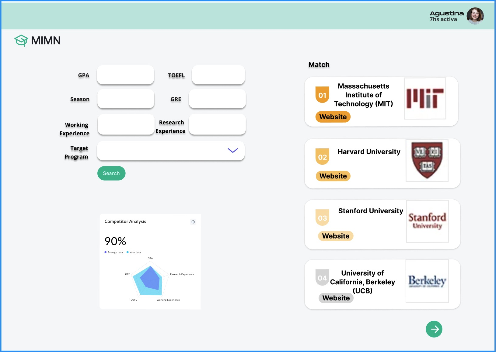

# Dream CS Graduate School Navigator

## Summary

Dream CS Graduate School Navigator is a cutting-edge program designed to optimize the graduate school admission process for prospective Computer Science (CS) students. Our technology leverages a comprehensive database of Computer Science graduate programs to provide customized suggestions based on the applicant's academic background.  

## Description

The field of computer science is highly competitive, with top programs receiving thousands of applications for a limited number of spots. Students often struggle to gauge their competitiveness and find programs that match their qualifications, leading to considerable confusion and stress during the application process.  

By leveraging machine learning algorithms to analyze historical admission data, our application provides personalized assessments of a student's chances of admission to various computer science graduate programs. It further matches students with graduate programs that align with their academic profile and preferences, simplifying the search for the right fit.

## Creativity
We are committed to delivering exceptionally accurate admission probability assessments for applicants. To achieve this, we plan to utilize various machine learning techniques, including linear regression, to analyze and interpret statistics from millions of data points. This approach will enable us to refine our predictions and offer users precise insights into their chances of admission to their dream programs.

## Usefulness

Dream College Navigator is designed to be a comprehensive tool that simplifies the college search and application process, making it more efficient and tailored to individual needs. Its usefulness stems from its ability to distill vast amounts of data into personalized assessments and recommendations, thereby saving users time and providing clarity in a process that can often feel overwhelming.

### 1. Basic Functions:
- Applicant Standings: Enables applicants to understand their positioning in relation to millions of others by comparing academic profiles.  
- College Match: Offers a curated list of universities tailored to the academic qualifications of applicants.  

### 2. Complex Features:
Admission Chance Simulation Tool: Utilize advanced machine learning techniques to assess students' admission probabilities by comparing their details with millions of applications in our dataset.

### 3. Similar Websites/Applications:
There are a few websites concerning computer science graduate school application like theGradCafe, College Board etc. However, none of these websites have the capability to offer personalized assessments of applicants' chances. Dream College Navigator distinguishes itself with its innovative Admission Chance Simulation tool, which evaluates the likelihood of applicants being accepted by their desired programs by analyzing millions of historical data points. Additionally, our website compares the academic backgrounds of applicants, including GRE scores and GPA, to provide a clearer understanding of where they stand among all applicants. This feature contributes to the platform's enhanced personalization and user-centric approach, which is not offered by similar websites.

## Dataset

### 1. Profile of Applicants
- Source: Kaggle and theGradCafe
- URL: https://www.kaggle.com/datasets/karun95/gradcafe-computer-science-results
- Format: csv
- Size: 3.7m rows, 14 columns
- Description: This is a comprehensive collection of applicants who applied to a computer science Graduate program as surveyed by theGradCafe. It includes the background of each applicant, including GRE scores and GPAs with the outcomes of their applications.

### 2. Ranking of Computer Science Universities
- Source: csranking.org
- URL: https://drive.google.com/file/d/1vyGdFx0x0RjYt9LPUVPW9MMC70aFism4/view?usp=drive_link
- Format: csv
- Size: 103 rows, 4 columns
- Description: This dataset top 100 Universities in their computer science programs.

## Functionality

### 1. User Account Management
Function: Allows users to create, update, delete and manage their account information.

User Interaction: Users can register for a new account by filling in basic information such as email address, password, etc. After registration, users can log in, edit their profile, change their password, or delete their account if necessary.

### 2. Admission Chance Evaluation
Function: Evaluates and estimates the chances of acceptance based on the user's input of academic background information (e.g., GPA, GRE, TOEFL scores, etc.) and target colleges.

User Interaction: User's academic backgrounds are collected through a form that includes elements such as drop-down menus, sliders, etc. so that the user can define search parameters for more accurate results. The analysis displays the users' admission probability as clear percentage.

### 3. Applicant Background Comparison
Function: Shows how the applicant compares to other applicants in terms of GPA, GRE, TOEFL and other metrics.

User Interaction: Users can see where they stand relative to other applicants on these metrics, possibly through dynamic charts or ranked lists.

### 4. Matching Colleges CS Rankings
Function: Provides colleges that match the applicant's background and ranks them by CSRanking.

User Interaction: Users can view the list of colleges according to the ranking of computer science majors and click on a college to get more information.

### 5. Data Management and Analysis
Functions: Maintain university database, update school information, admission criteria, etc.

## A low-fidelity UI mockup

## Work Distribution

Qi Cui: Front-end and UI Design
Focus on user interface design and implementation, including front-end development of user account management interface, personalized college search interface, admission probability calculator, and scenario simulation tools.

Yuhui Lai: Back-end development and API implementation (user management and authentication)
Develop back-end logic and API for handling user account creation, login, profile update, etc. Implement user authentication and authorization to ensure the security of data transmission.

Xiaotian Zhao: Back-end development and API implementation (college search and admission probability calculation)
Develop back-end API that handle personalized university search and admission probability calculation.

Jiadong Gui: Database Management, Data Analysis and Deployment Maintenance
Focus on database design, management and maintenance.
