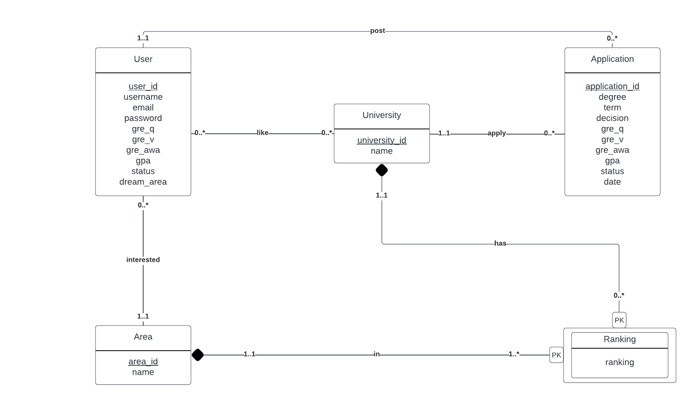

# Database Design

## 1. UML Diagram

## 2. Entities
### 2.1 User
- **Description:** A user is an individual who creates an account on the website. It keeps track of a user's account information (username, password, etc.) and user academic profile (GPA, GRE, status, etc.).
- **Assumption:** We assume each user can only create one account, thus the information is unique which is identified by `user_id`.
- It is modeled as an entity because of its role in symbolizing the website's user. Ths user entity enables interactions with multiple other entities including liking a university, posting an application etc.

### 2.2 University
- **Description:** This entity represents graduate-level institutions, containing a university's name as its primary attribute.
- **Assumption:** Each university has a distinct name, associated with a unique `university_id`.
- It is modeled as an entity to allow for relationships between ranking, application, and user. This enables the website to collect admission statistics and rankings at the university-level.

### 2.3 Area
- **Description:** Denotes fields of study within computer science, containing a area's name as its primary attribute.
- **Assumption:** Each area is distinct, with a name identified by a unique `area_id`.
- It is modeled as an entity to allow for connections between rankings and users, allowing users to specify their interests in multiple areas to obtain tailored matches. Additionally, it supports tracking of university rankings in each area.

### 2.4 Application
**Description:** Captures the exisiting applications within our dataset, including an applicant's academic background (GPA, GRE, status, etc.), application outcome (decision, date), and the university they applied to.
- **Assumption:** Every application is considered unique with an exclusive `application_id`.
- It is modeled as an entity to support relationships with both universities and users, allowing users to post their application records. Moreover, the relationship between university and application contributes to analyzing the application statistics for each university.

### 2.5 Ranking
**Description:** Represents the relative standing for each university in various areas of study.
- **Assumption:** Each ranking record is unique, differentiated by a key pair consisting of `university_id` and `area_id`.
- It is modeled as an entity to allow for relationships with areas and universities, reflecting the variability in university rankings across different specializations.

## 3. Relationships
### 3.1 User - University: like
- **One to Many:** We specify that each user is required to pick a single "dream university" they favor, and each university can be favored by a varying number of students, from none to many.
- **Assumption:** The relationship is based on a specific constraint of the website. When users create accounts, they will be prompted to identify just one "dream university". Consequently, tt is possible for certain universities to be not favored by any user.

### 3.2 Application - Unviersity: apply
- **One to Many:** Each application is restricted to applying to one university, while each university may receive none to many applications.
- **Assumption:** This comes from the requirement of typical college application process, with the specification of a single university per application. It is possible that certain universities receives no applications within our dataset.

### 3.3 User - Application: post
- **One to Many:** A single user can post multiple application results. However, each application must be associated exclusively with one user.
- **Assumption:** We encourage users to submit application results to contribute to the community voluntarily, allowing for submission of multiple results or opting not to participate. Meanwhile, each application must be traceable to a specific applicant.

### 3.4 User - Area: interested
- **Many to Many:** A user may express interest in an array of areas, while each area may attract interest from zero or many students.
- **Assumption:** This comes from the website constraint. When users create accounts, they will be encouraged to optionally indicate areas of interest for customized matches. It is possible that a certain area might not captivate the interest of any user.

### 3.5 University - Ranking: has
- **One to Many:** Each university may have multiple rankings across various areas of study. However, each ranking record must be associated with one university.
- **Assumption:** Given that we multiple areas, each universtiy may achieve rankings in several fields. It is possible that a university may not be featured in the ranking system (e.g. not within the CSRankings top 100) or to hold positions across multiple areas.

### 3.5 Area - Ranking: in
- **One to Many:** Each area is expected to have at least one ranking record, representing universities standings within that particular field of study. Conversely, each ranking is uniquely linked to a single area.
- **Assumption:** This comes from the structure of our dataset. Each area is represented through various ranking records, and each of these records is dedicated to a particular area.
