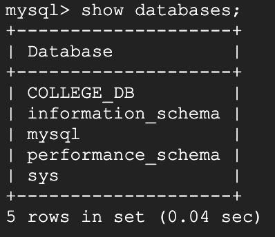
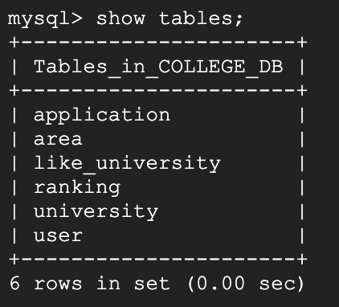
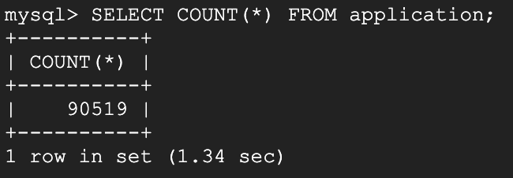
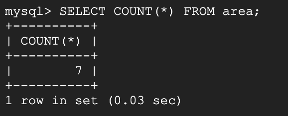
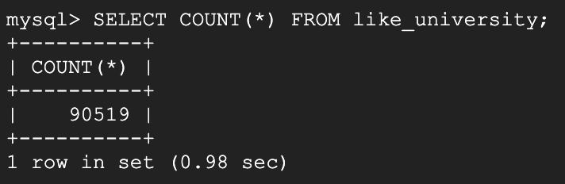
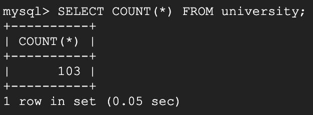
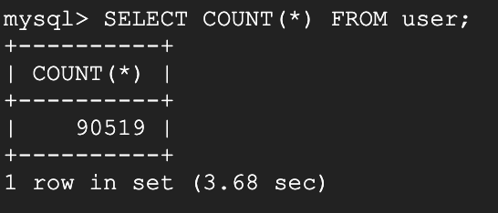

# Database Design

## Database Implementation

### 1. Database Connection




### 2. DDL Commands
```sql
CREATE DATABASE IF NOT EXISTS COLLEGE_DB;
USE COLLEGE_DB;

DROP TABLE IF EXISTS area;
CREATE TABLE area (
    area_id INT,
    name    VARCHAR(100),

    PRIMARY KEY (area_id)
);

DROP TABLE IF EXISTS user;
CREATE TABLE user (
    user_id     VARCHAR(100),
    username    VARCHAR(100) NOT NULL,
    email       VARCHAR(100) NOT NULL,
    password    VARCHAR(100) NOT NULL,
    gre_q       INT,
    gre_v       INT,
    gre_awa     REAL,
    gpa         REAL,
    status      VARCHAR(100),
    dream_area  INT NOT NULL,

    PRIMARY KEY (user_id),
    FOREIGN KEY (dream_area) REFERENCES area(area_id)
);

DROP TABLE IF EXISTS university;
CREATE TABLE university (
    university_id INT,
    name          VARCHAR(100),

    PRIMARY KEY (university_id)
);

DROP TABLE IF EXISTS application;
CREATE TABLE application (
    user_id         VARCHAR(100),
    application_id  VARCHAR(100),
    degree          VARCHAR(100),
    term            VARCHAR(100),
    decision        VARCHAR(100),
    gre_q           INT,
    gre_v           INT,
    gre_awa         REAL,
    gpa             REAL,
    status          VARCHAR(100),
    university      INT,
    decision_date   DATE,

    PRIMARY KEY (application_id),
    FOREIGN KEY (user_id) REFERENCES user(user_id)
);

DROP TABLE IF EXISTS ranking;
CREATE TABLE ranking (
    university_id   INT,
    area_id         INT,
    ranking         INT,

    PRIMARY KEY (university_id, area_id),
    FOREIGN KEY (university_id) REFERENCES university(university_id),
    FOREIGN KEY (area_id) REFERENCES area(area_id)
);

DROP TABLE IF EXISTS like_university;
CREATE TABLE like_university (
    user_id             VARCHAR(100),
    liked_university    INT,

    PRIMARY KEY (user_id, liked_university),
    FOREIGN KEY (user_id) REFERENCES user(user_id),
    FOREIGN KEY (liked_university) REFERENCES university(university_id)
);
```

### 3. Table Counts
Each table is populated with locally stored csv files. Some attributes are randomly generated.  

**Application:**



**Area:**



**Like University:**



**Ranking:**


**University:**



**User:**


