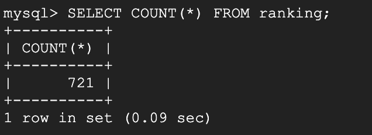
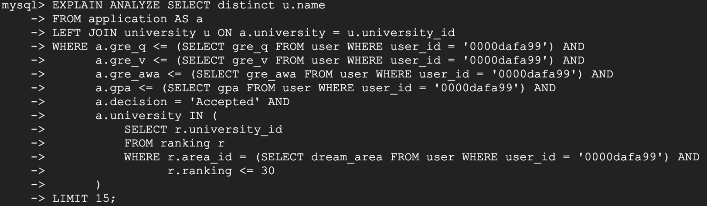
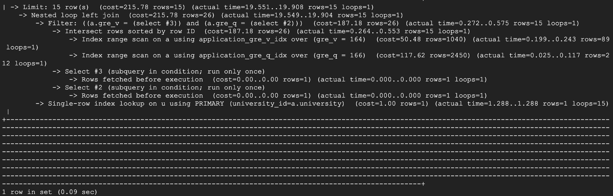

# Database Design

## Database Implementation

### 1. Database Connection


### 2. DDL Commands
```sql
CREATE DATABASE IF NOT EXISTS COLLEGE_DB;
USE COLLEGE_DB;

DROP TABLE IF EXISTS area;
CREATE TABLE area (
    area_id INT,
    name    VARCHAR(100),

    PRIMARY KEY (area_id)
);

DROP TABLE IF EXISTS user;
CREATE TABLE user (
    user_id     VARCHAR(100),
    username    VARCHAR(100) NOT NULL,
    email       VARCHAR(100) NOT NULL,
    password    VARCHAR(100) NOT NULL,
    gre_q       INT,
    gre_v       INT,
    gre_awa     REAL,
    gpa         REAL,
    status      VARCHAR(100),
    dream_area  INT NOT NULL,

    PRIMARY KEY (user_id),
    FOREIGN KEY (dream_area) REFERENCES area(area_id)
);

DROP TABLE IF EXISTS university;
CREATE TABLE university (
    university_id INT,
    name          VARCHAR(100),

    PRIMARY KEY (university_id)
);

DROP TABLE IF EXISTS application;
CREATE TABLE application (
    user_id         VARCHAR(100),
    application_id  VARCHAR(100),
    degree          VARCHAR(100),
    term            VARCHAR(100),
    decision        VARCHAR(100),
    gre_q           INT,
    gre_v           INT,
    gre_awa         REAL,
    gpa             REAL,
    status          VARCHAR(100),
    university      INT,
    decision_date   DATE,

    PRIMARY KEY (application_id),
    FOREIGN KEY (user_id) REFERENCES user(user_id)
);

DROP TABLE IF EXISTS ranking;
CREATE TABLE ranking (
    university_id   INT,
    area_id         INT,
    ranking         INT,

    PRIMARY KEY (university_id, area_id),
    FOREIGN KEY (university_id) REFERENCES university(university_id),
    FOREIGN KEY (area_id) REFERENCES area(area_id)
);

DROP TABLE IF EXISTS like_university;
CREATE TABLE like_university (
    user_id             VARCHAR(100),
    liked_university    INT,

    PRIMARY KEY (user_id, liked_university),
    FOREIGN KEY (user_id) REFERENCES user(user_id),
    FOREIGN KEY (liked_university) REFERENCES university(university_id)
);
```

### 3. Table Counts
Each table is populated with locally stored csv files. Some attributes are randomly generated.  

**Application:**


**Area:**


**Like University:**


**Ranking:**



**University:**


**User:**


## Queries

### 1. Query 1

This query retrieves the details of applicants who have been accepted to a user's dream school and have GRE Quantitative (`gre_q`) and GRE Verbal (`gre_v`) scores equal to or above the average of all applicants. It provides the user with an understanding of the academic profiles of above-average applicants to their preferred university.

```sql
SELECT user_id,
        application_id,
        degree,
        term,
        decision,
        gre_q,
        gre_v,
        gre_awa,
        gpa,
        status,
        u.name,
        decision_date
FROM application a
LEFT JOIN university u ON u.university_id = a.university
WHERE   a.university = (SELECT liked_university 
                        FROM like_university l    
                        WHERE l.user_id = '0000dafa99')
        AND a.decision = 'Accepted'
        AND a.gre_q >= (SELECT avg(application.gre_q) AS avg_gre_q
                        FROM application)
        AND a.gre_v >= (SELECT avg(application.gre_v) AS avg_gre_v
                        FROM application)
LIMIT 15;
```


### 2. Query 2

This query searches for universities that have accepted applications with GRE Quantitative, Verbal, Analytical Writing scores, and GPA equal to or lower than those of the specified user. It aims to identify universities where a specific user could potentially gain admission based on their academic and GRE profile.

```sql
SELECT distinct u.name
FROM application AS a
LEFT JOIN university u ON a.university = u.university_id
WHERE a.gre_q <= (SELECT gre_q FROM user WHERE user_id = '0000dafa99') AND 
      a.gre_v <= (SELECT gre_v FROM user WHERE user_id = '0000dafa99') AND 
      a.gre_awa <= (SELECT gre_awa FROM user WHERE user_id = '0000dafa99') AND
      a.gpa <= (SELECT gpa FROM user WHERE user_id = '0000dafa99') AND
      a.decision = 'Accepted' AND
      a.university IN (
          SELECT r.university_id
          FROM ranking r
          WHERE r.area_id = (SELECT dream_area FROM user WHERE user_id = '0000dafa99') AND
                r.ranking <= 30
      )
LIMIT 15;
```


### 3. Query 3

This SQL query fetches details from applications where the applicants' GRE Quantitative (`gre_q`) and Verbal (`gre_v`) scores exactly match those of a specific user. This enables the user to gain insights into the application background of applicants with similar academic profiles.

```sql
SELECT user_id,
        application_id,
        degree,
        term,
        decision,
        gre_q,
        gre_v,
        gre_awa,
        gpa,
        status,
        u.name,
        decision_date
FROM application a
LEFT JOIN university u ON u.university_id = a.university
WHERE   gre_q = (SELECT gre_q 
                FROM user
                WHERE user.user_id = '0000dafa99') AND 
        gre_v = (SELECT gre_v 
                FROM user
                WHERE user.user_id = '0000dafa99')
LIMIT 15;
```


### 4. Query 4

This SQL provides a specific user with a list of universities, along with their rankings and the number of accepted cases in their dream area of study. It offers insights into the acceptance volume at top-ranked universities within that area, assisting the user in assessing the competitiveness of these institutions.

```sql
SELECT university.name, 
        a.name,
        r.ranking,
        tmp.accepted_cases
FROM user u
LEFT JOIN area a ON u.dream_area = a.area_id
LEFT JOIN ranking r ON r.area_id = u.dream_area
LEFT JOIN university  ON university.university_id = r.university_id
LEFT JOIN 
    (SELECT university, 
            COUNT(*) AS accepted_cases
    FROM application
    WHERE decision = 'Accepted'
    GROUP BY university) tmp
ON tmp.university = r.university_id
WHERE u.user_id = '0000dafa99' AND r.ranking  IS NOT NULL 
ORDER BY r.ranking
LIMIT 15;
```


## Indexing

### 1. Query 1

#### Command


#### Analysis before indexing


#### Index Design 1: CREATE INDEX `application_gpa_idx` on application(`gpa`)

By adding an index to the `gpa` attribute, the query cost is slightly reduced to 10169, indicating that the direct impact of indexing on the performance of that particular query is minimal. This may be because the fact that the query is primarily filtered based on GRE scores (`gre_q`, `gre_v`), college preferences, and admissions decisions, none of which are directly related to the `gpa` attribute.


 
#### Index Design 2: CREATE INDEX `application_decision_idx` on application(`decision`)

By adding an index to the `decision` attribute, the query cost is significantly reduced to 1941. This may be because the query specifically filters on the `decision` attribute to retrieve only 'Accepted' cases. The index on `decision` allows the database to quickly locate these records without scanning the entire table, greatly reducing the amount of work needed to execute the query.


#### Index Design 3: CREATE INDEX `application_decision_idx` on application(`decision`) CREATE INDEX `application_gpa_idx` on application(`gpa`)

By adding indices to the `gpa` and `decision` attribute, the query cost is slightly increased to 2008. This may be because the `decision` index filters accepted applications by efficiently filtering them, whereas the `gpa` index imposes an additional overhead that does not directly improve the performance of that performance of the particular query.


### 2. Query 2

#### Command



#### Analysis before indexing


#### Index Design 1: CREATE INDEX `application_decision_idx` on application(`decision`)

By adding an index to the `decision` attribute, the query cost is significantly reduced to 2223. This may be because the query uses the `decision` attribute directly in the filtering criteria. `Decision` index enable the database to quickly find and filter accepted applications without having to scan the entire table, thus greatly reducing the cost.


#### Index Design 2: CREATE INDEX `university_name__idx` on university(`name`)

By adding an index to the `name` attribute, the query cost is slightly increased to 9421. This may be because the query joins tables by `id` rather than by `name`.


#### Index Design 3: CREATE INDEX `application_gpa__idx` on application(`gpa`)

By adding an index to the `gpa` attribute, the query cost is increased to 10211. This may be because the query does include a condition on `gpa`, it is compared against a user-specific value rather than used to directly filter the application table. The condition's specificity to a user's `gpa` limits the effectiveness of the index in this context.


### 3. Query 3

#### Command


#### Analysis before indexing


#### Index Design 1: CREATE INDEX `university_name_idx` on university(`name`)

By adding an index to the `name` attribute, the query cost is slightly reduced to 10764, indicating that the direct impact of indexing on the performance of that particular query is minimal. This may be because the query is primarily filtered based on GRE scores (`gre_q`, `gre_v`), none of which are directly related to the `gpa` attribute.


#### Index Design 2: CREATE INDEX `application_gre_q_idx` on application(`gre_q`)

By adding an index to the `gre_q` attribute, the query cost is significantly reduced to 1664. This may be because the use of `gre_q` in the WHERE clause of the query. If an index to `gre_q` is created, it is possible to quickly find the `gre_q` for a specific user.


#### Index Design 3: CREATE INDEX `application_gre_v_idx` on application(`gre_v`), CREATE INDEX `application_gre_q_idx` on application(`gre_q`)

By adding indices to the `gre_q` and `gre_v` attributes, the query cost is reduced to 215. The database can efficiently locate rows that match the specific `gre_q` and `gre_v` needed for a query without scanning the entire table.



### 4. Query 4

#### Command


#### Analysis before indexing


#### Index Design 1: CREATE INDEX `ranking_ranking_idx` on ranking(`ranking`)

By adding an index to the `ranking` attribute, the query cost is slightly reduced to 418. While there is a slight increase in efficiency, the overall impact on query performance is limited.


#### Index Design 2: CREATE INDEX `university_name_idx` on university(`name`)

By adding an index to the `name` attribute, the query cost is slightly reduced to 424. However, its overall impact on the query is minimal.


#### Index Design 3: CREATE INDEX `application_gpa__idx` on application(`gpa`);

By adding an index to the `gpa` attribute, the query cost remains at 428. This may be because the query is not related to `gpa`, the indexing does not help to reduce the cost.


